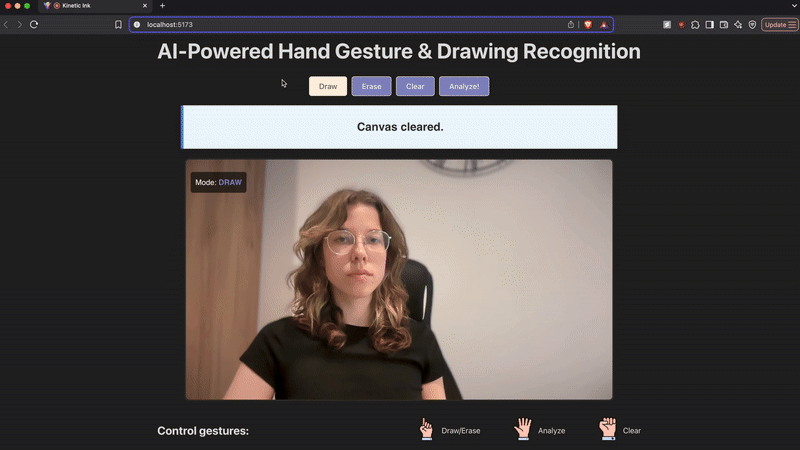

# Kinetic Ink: AI Gesture Recognition Canvas


An interactive web application that transforms your hand into a paintbrush and your browser into an intelligent art critic. Draw on a digital canvas using real-time hand gestures, then command an AI to analyze your creation with a wave of your hand.

---



## Table of Contents

- [Features](#features)
- [Technology Stack](#technology-stack)
- [Core Concepts Explained](#core-concepts-explained)
  - [Gesture Control System](#gesture-control-system)
  - [End-to-End Machine Learning Workflow](#end-to-end-machine-learning-workflow)
- [Running the Project Locally](#running-the-project-locally)
- [Future Improvements](#future-improvements)

## Features

- **Gesture-Based Drawing:** Use your index finger to draw directly onto the canvas in real-time.
- **Gesture-Based Commands:**
  - **Open Hand:** Triggers the AI model to analyze the current drawing.
  - **Fist:** Clears the canvas.
- **AI Drawing Recognition:** A custom-trained Convolutional Neural Network (CNN) predicts what you've drawn. The pre-trained model is configured to recognize four distinct classes: **Heart 💜, Bow 🎀, Mountain 🏔, and Ramen 🍜**.
- **Dual Control System:** All gesture commands are also available as on-screen buttons for maximum accessibility and usability.
- **Erase Mode:** A dedicated mode to erase parts of the drawing with pixel-perfect precision.
- **Real-Time Visual Feedback:** The application renders the detected hand skeleton, providing users with immediate feedback on what the system is "seeing."

## Technology Stack

- **Front-End:** **React** & **TypeScript** for a robust, type-safe, and component-based UI.
- **Computer Vision:** **Google MediaPipe** (Hands Solution) for real-time, high-fidelity hand and finger landmark detection directly in the browser.
- **Machine Learning (Training):** **Python** & **TensorFlow (Keras)** within a **Google Colab** environment for model architecture, training, and data pre-processing.
- **Machine Learning (Inference):** **TensorFlow.js** for executing the trained model directly in the browser, enabling fast, client-side AI predictions without server-side dependencies.

## Core Concepts Explained

Beyond its interactive features, this application showcases the complete lifecycle of a machine learning project: from custom data collection and model training to deployment for real-time, in-browser inference.

### Gesture Control System

The user interface is primarily driven by hand poses.

1.  **Landmark Detection:** On every video frame, MediaPipe provides 21 3D landmarks for the user's hand.
2.  **Geometric Rule-Based Logic:** Instead of a complex second ML model, a set of simple geometric rules written in TypeScript determines the current pose. For example:
    - **Pointing:** The tip of the index finger is significantly above its middle joint, while other fingertips are below theirs.
    - **Fist:** All fingertips are below their middle joints, and the thumb tip is close to the middle/ring finger knuckles.
    - **Open Hand:** All fingertips are extended and above their middle joints.
3.  **State-Change Trigger Lock:** To prevent actions from firing 30 times per second, the application only triggers a command when the gesture _changes_ from one state to another (e.g., from `None` to `Fist`). A cooldown period is also enforced to prevent accidental re-triggering.

### End-to-End Machine Learning Workflow

The accuracy of the AI analysis depends on a rigorous and consistent pipeline.

1.  **Data Collection:** A custom data collection tool was built into the React app. This allowe the rapid creation of a high-quality, and consistent dataset of drawings for each class.

2.  **Data Pre-processing (Python/Colab):** Before training, every image in the dataset went through a critical pre-processing script:

    - **Crop-to-Content:** The script first finds the bounding box of the actual drawing, discarding empty surrounding space.
    - **Pad-to-Square:** The cropped image is then resized to fit within a 192x192 square while preserving its aspect ratio. The remaining space is filled with black padding. This ensures all drawings are centered and scaled uniformly.

3.  **Model Training:** A Convolutional Neural Network (CNN) was designed and trained in TensorFlow on this processed dataset. Data augmentation (random rotations, zooms, shifts) was applied to the training set to make the model more robust and prevent overfitting.

4.  **Model Conversion:** The final trained Keras model (`.h5`) was converted into the **TensorFlow.js Layers format** (`model.json` and weight shards), optimized for web deployment.

5.  **Inference-Time Pre-processing (TypeScript):** This is the most critical step for accuracy. The exact same "crop-to-content" and "pad-to-square" logic from the Python script was replicated in TypeScript. Before a user's drawing is sent to the model for prediction, it undergoes this identical transformation. This guarantees that the model sees live data in the exact same format as the data it was trained on, decreasing the gap between training data and in-app drawings.

## Running the Project Locally

**Important Note:** This repository contains the front-end application code only. The pre-trained model files and the training dataset are not included. To run the application with full AI functionality, you must train your own model and integrate it by following the steps below.

### Part A: Run the Front-End Application

This will launch the application with all drawing and gesture detection features, but the "Analyze" function will not work until a model is provided.

1.  **Clone the Repository**

    ```bash
    git clone https://github.com/your-username/your-repo-name.git
    cd your-repo-name
    ```

2.  **Install Dependencies**

    ```bash
    npm install
    ```

3.  **Run the Development Server**

    ```bash
    npm run dev
    ```

4.  Open your browser to the provided local address. You will need to grant camera permissions.

### Part B: Train and Prepare Your Own Model

1.  **Gather Training Data:** Create a dataset of images (`.png` or `.jpg`) for each class you want the AI to recognize. Each class should have its own sub-folder (e.g., `data/heart`, `data/bow`, etc.). You can use the `handleSave` utils function included in this project to easily save your own data directly from the running app.

2.  **Train in Google Colab:** Set up a Google Colab notebook with Python and TensorFlow.
    - **Pre-process your data** using the "crop-to-content" and "pad-to-square" logic described in the "Workflow" section above. The main logic is placed in `preProcessCanvas` utils function.
    - **Design and train a CNN** on your processed dataset.
    - **Convert the final model** into the TensorFlow.js format (`model.json` and binary weight files).

### Part C: Integrate Your Model into the App

1.  **Place Model Files:** Create a `tfjs_model` directory inside the `/public` folder of this project. Place your `model.json` and all associated `.bin` weight files into `/public/tfjs_model/`.

2.  **Update Class Labels:** In the application code, find the array that defines the class names (e.g., `EMOJI_CLASSES`). Update this array to match the classes your model was trained on, ensuring the order is the same.

Once these steps are complete, the "Analyze" feature in your local application will be fully functional.

### Have fun with my app!
